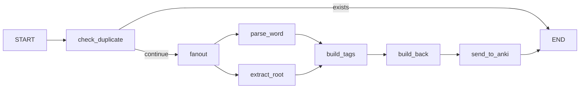

# LangGraph Anki Loader

A Korean vocabulary learning tool that uses LangGraph and Azure OpenAI to automatically parse Korean words, extract roots/hanja, and create Anki flashcards via AnkiConnect.

## Features

- Parse Korean words with LLM to extract meaning, part of speech, and example sentences
- Extract word roots and hanja (Chinese characters) information
- Automatically create or update Anki flashcards
- Duplicate detection to avoid creating redundant cards
- Batch processing support for multiple words

## Architecture

The core processing uses a LangGraph StateGraph with parallel execution:



## Prerequisites

- Python 3.13+
- [uv](https://docs.astral.sh/uv/) package manager
- [Anki](https://apps.ankiweb.net/) with [AnkiConnect](https://ankiweb.net/shared/info/2055492159) plugin installed
- Azure OpenAI API access

## Installation

1. Clone the repository:
```bash
git clone https://github.com/plusoneee/langgraph-anki-loader.git
cd langgraph-anki-loader
```

2. Install dependencies:
```bash
uv sync
```

3. Create your environment file:
```bash
cp .env.example .env
```

4. Edit `.env` with your credentials:
```
AZURE_OPENAI_API_KEY=your-api-key
AZURE_OPENAI_ENDPOINT=https://your-resource.openai.azure.com/
```

## Usage

> **Important:** Make sure Anki is running before starting the server. AnkiConnect only works when Anki is open. If Anki is not running, requests to `ANKI_URL` will fail with a connection error.

1. Start Anki application

2. Run the FastAPI server:
```bash
uv run uvicorn main:app --reload
```

3. The API will be available at http://127.0.0.1:8000

### API Endpoints

#### Parse Single Word
```bash
curl -X POST http://127.0.0.1:8000/parse \
  -H "Content-Type: application/json" \
  -d '{"word": "안녕하세요", "force_update": false}'
```

#### Parse Multiple Words
```bash
curl -X POST http://127.0.0.1:8000/parse-batch \
  -H "Content-Type: application/json" \
  -d '{"words": ["안녕하세요", "감사합니다"], "force_update": false}'
```

## Configuration

Environment variables (see `.env.example`):

| Variable | Description | Default |
|----------|-------------|---------|
| `AZURE_OPENAI_API_KEY` | Azure OpenAI API key | (required) |
| `AZURE_OPENAI_ENDPOINT` | Azure OpenAI endpoint URL | (required) |
| `AZURE_OPENAI_API_VERSION` | API version | `2025-01-01-preview` |
| `AZURE_OPENAI_DEPLOYMENT` | Model deployment name | `gpt-4o-mini-0` |
| `ANKI_URL` | AnkiConnect URL | `http://127.0.0.1:8765` |
| `ANKI_DECK_NAME` | Target Anki deck | `Korean::Auto` |
| `ANKI_MODEL_NAME` | Anki note type | `Basic` |
