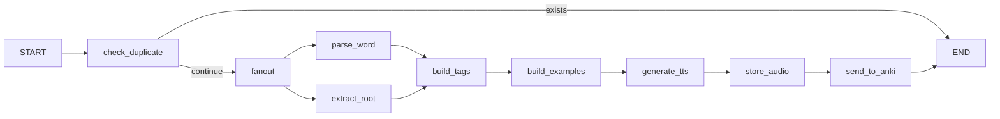
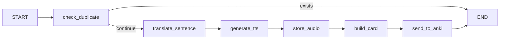

# Anki Kor Agent

[繁體中文](README.zh-TW.md)

A Korean learning agent that uses LangGraph and Azure OpenAI to automatically create Anki flashcards. Supports both vocabulary cards and listening cards with TTS audio.

## Features

### Vocabulary Cards (`/vocab`)
- Parse Korean words with LLM to extract meaning, part of speech, and example sentences
- Extract word roots and hanja (Chinese characters) information
- Generate TTS audio for word pronunciation
- Automatically create or update Anki flashcards with structured fields (Word, Audio, Meaning, POS, Examples)
- Duplicate detection to avoid creating redundant cards

### Listening Cards (`/listening`)
- Generate TTS audio from Korean sentences using Google TTS (gTTS)
- Auto-translate Korean to Chinese if translation not provided
- Create listening-focused cards (audio front, text back)
- Automatically create Anki deck and note type

## Architecture

### Vocabulary Pipeline



### Listening Pipeline



## Prerequisites

- Python 3.13+
- [uv](https://docs.astral.sh/uv/) package manager
- [Anki](https://apps.ankiweb.net/) with [AnkiConnect](https://ankiweb.net/shared/info/2055492159) plugin installed
- Azure OpenAI API access

## Installation

1. Clone the repository:
```bash
git clone https://github.com/plusoneee/anki-kor-agent.git
cd anki-kor-agent
```

2. Install dependencies:
```bash
uv sync
```

3. Create your environment file:
```bash
cp .env.example .env
```

4. Edit `.env` with your credentials:
```
AZURE_OPENAI_API_KEY=your-api-key
AZURE_OPENAI_ENDPOINT=https://your-resource.openai.azure.com/
```

## Usage

> **Important:** Make sure Anki is running before starting the server. AnkiConnect only works when Anki is open.

1. Start Anki application

2. Run the FastAPI server:
```bash
uv run uvicorn main:app --reload
```

3. The API will be available at http://127.0.0.1:8000

### API Endpoints

#### Vocabulary - Single Word
```bash
curl -X POST http://127.0.0.1:8000/vocab \
  -H "Content-Type: application/json" \
  -d '{"word": "학생", "force_update": false}'
```

#### Vocabulary - Batch
```bash
curl -X POST http://127.0.0.1:8000/vocab/batch \
  -H "Content-Type: application/json" \
  -d '{"words": ["학생", "선생님"], "force_update": false}'
```

#### Listening - Single Sentence
```bash
# With user-provided translation
curl -X POST http://127.0.0.1:8000/listening \
  -H "Content-Type: application/json" \
  -d '{"korean_sentence": "안녕하세요", "chinese_translation": "你好"}'

# Auto-translate with LLM
curl -X POST http://127.0.0.1:8000/listening \
  -H "Content-Type: application/json" \
  -d '{"korean_sentence": "오늘 날씨가 좋아요"}'
```

#### Listening - Batch
```bash
curl -X POST http://127.0.0.1:8000/listening/batch \
  -H "Content-Type: application/json" \
  -d '{
    "sentences": [
      {"korean_sentence": "안녕하세요", "chinese_translation": "你好"},
      {"korean_sentence": "감사합니다"}
    ]
  }'
```

## Configuration

Environment variables (see `.env.example`):

### Azure OpenAI Settings

| Variable | Description | Default |
|----------|-------------|---------|
| `AZURE_OPENAI_API_KEY` | Azure OpenAI API key | (required) |
| `AZURE_OPENAI_ENDPOINT` | Azure OpenAI endpoint URL | (required) |
| `AZURE_OPENAI_API_VERSION` | API version | `2025-01-01-preview` |
| `AZURE_OPENAI_DEPLOYMENT` | Model deployment name | `gpt-4o-mini-0` |

### Anki Vocabulary Settings

| Variable | Description | Default |
|----------|-------------|---------|
| `ANKI_URL` | AnkiConnect URL | `http://127.0.0.1:8765` |
| `ANKI_DECK_NAME` | Target Anki deck | `Korean::Auto` |
| `ANKI_VOCAB_MODEL_NAME` | Anki note type (auto-created) | `Korean_Vocab_Auto` |

### Anki Listening Settings

| Variable | Description | Default |
|----------|-------------|---------|
| `ANKI_LISTENING_DECK_NAME` | Listening deck | `Korean::Listening` |
| `ANKI_LISTENING_MODEL_NAME` | Listening note type | `Listening` |
| `ANKI_LISTENING_TAG_DEFAULT` | Default tag | `listening_auto` |

## Project Structure

```
src/
├── routers/                   # FastAPI routers
│   ├── vocab.py               # /vocab endpoints
│   └── listening.py           # /listening endpoints
├── graph/
│   ├── vocab_loader.py        # Vocabulary LangGraph pipeline
│   └── listening_loader.py    # Listening LangGraph pipeline
├── models/
│   ├── vocab_state.py         # Vocabulary state definition
│   └── listening_state.py     # Listening state definition
├── nodes/
│   ├── vocab/                 # Vocabulary processing nodes
│   └── listening/             # Listening processing nodes
├── service/
│   ├── vocab_anki_service.py
│   └── listening_anki_service.py
├── prompt/                    # LLM prompt YAML files
└── utils/
    ├── anki.py                # AnkiConnect client
    ├── llm.py                 # Azure OpenAI wrapper
    └── tts.py                 # Google TTS wrapper
```
