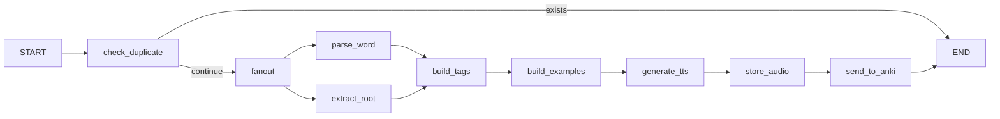
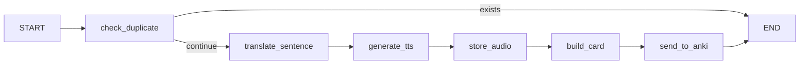

# Anki Kor Agent

[English](README.md)

用 LangGraph 和 Azure OpenAI 自動製作 Anki 韓文學習卡的工具。支援單字卡和聽力卡（含 TTS 語音）。

## 功能介紹

### 單字卡 (`/vocab`)
- 用 LLM 解析韓文單字，抓出字義、詞性和例句
- 擷取字根和漢字資訊
- 產生 TTS 語音幫助發音練習
- 自動新增或更新 Anki 卡片（包含 Word、Audio、Meaning、POS、Examples 欄位）
- 重複偵測，不會建立重複的卡片

### 聽力卡 (`/listening`)
- 用 Google TTS (gTTS) 產生韓文語音
- 沒提供翻譯的話，會自動把韓文翻成中文
- 建立聽力練習卡（正面放音檔、背面放文字）
- 自動建立 Anki 牌組和筆記類型

## 架構圖

### 單字處理流程



### 聽力處理流程



## 事前準備

- Python 3.13+
- [uv](https://docs.astral.sh/uv/) 套件管理器
- [Anki](https://apps.ankiweb.net/) 搭配 [AnkiConnect](https://ankiweb.net/shared/info/2055492159) 外掛
- Azure OpenAI API 權限

## 安裝步驟

1. Clone 這個專案：
```bash
git clone https://github.com/plusoneee/anki-kor-agent.git
cd anki-kor-agent
```

2. 安裝套件：
```bash
uv sync
```

3. 複製環境變數範本：
```bash
cp .env.example .env
```

4. 編輯 `.env`，填入你的金鑰：
```
AZURE_OPENAI_API_KEY=your-api-key
AZURE_OPENAI_ENDPOINT=https://your-resource.openai.azure.com/
```

## Docker 部署（推薦）

最簡單的使用方式是透過 Docker Compose。

### 事前準備
- 已安裝 [Docker](https://docs.docker.com/get-docker/) 和 [Docker Compose](https://docs.docker.com/compose/install/)
- 本機有執行 Anki 並安裝 AnkiConnect 外掛

### 快速開始

1. 複製環境變數範本：
```bash
cp .env.example .env
```

2. 編輯 `.env`，填入你的 Azure OpenAI 金鑰：
```bash
# 必填：填入你的 Azure OpenAI 憑證
AZURE_OPENAI_API_KEY=your-api-key
AZURE_OPENAI_ENDPOINT=https://your-resource.openai.azure.com/
```

3. 打開本機的 Anki

4. 用 Docker Compose 啟動：
```bash
docker-compose up -d
```

5. API 網址：http://localhost:8000

### Docker 常用指令

```bash
# 啟動服務
docker-compose up -d

# 查看 log
docker-compose logs -f

# 停止服務
docker-compose down

# 改完 code 後重新建置
docker-compose up -d --build
```

**注意事項：**
- Docker 會自動用 `host.docker.internal:8765` 連接本機的 Anki
- 音訊檔案會存在 `./audio` 資料夾
- 同一個 `.env` 檔案可以給 Docker 和本機開發都用

## 本機開發

### 怎麼用

> **注意：** 跑伺服器之前要先打開 Anki。AnkiConnect 只有在 Anki 開著的時候才能用。

1. 打開 Anki

2. 啟動 FastAPI 伺服器：
```bash
uv run uvicorn main:app --reload
```

3. API 網址：http://127.0.0.1:8000

### API 端點

#### 單字 - 單一個字
```bash
curl -X POST http://127.0.0.1:8000/vocab \
  -H "Content-Type: application/json" \
  -d '{"word": "학생", "force_update": false}'
```

#### 單字 - 一次多個字
```bash
curl -X POST http://127.0.0.1:8000/vocab/batch \
  -H "Content-Type: application/json" \
  -d '{"words": ["학생", "선생님"], "force_update": false}'
```

#### 聽力 - 單一句子
```bash
# 自己提供翻譯
curl -X POST http://127.0.0.1:8000/listening \
  -H "Content-Type: application/json" \
  -d '{"korean_sentence": "안녕하세요", "chinese_translation": "你好"}'

# 讓 LLM 自動翻譯
curl -X POST http://127.0.0.1:8000/listening \
  -H "Content-Type: application/json" \
  -d '{"korean_sentence": "오늘 날씨가 좋아요"}'
```

#### 聽力 - 一次多句
```bash
curl -X POST http://127.0.0.1:8000/listening/batch \
  -H "Content-Type: application/json" \
  -d '{
    "sentences": [
      {"korean_sentence": "안녕하세요", "chinese_translation": "你好"},
      {"korean_sentence": "감사합니다"}
    ]
  }'
```

## 環境變數設定

詳見 `.env.example`

### Azure OpenAI 設定

| 變數 | 說明 | 預設值 |
|------|------|--------|
| `AZURE_OPENAI_API_KEY` | Azure OpenAI API 金鑰 | （必填） |
| `AZURE_OPENAI_ENDPOINT` | Azure OpenAI 端點網址 | （必填） |
| `AZURE_OPENAI_API_VERSION` | API 版本 | `2025-01-01-preview` |
| `AZURE_OPENAI_DEPLOYMENT` | 模型部署名稱 | `gpt-4o-mini-0` |

### Anki 單字卡設定

| 變數 | 說明 | 預設值 |
|------|------|--------|
| `ANKI_URL` | AnkiConnect 網址 | `http://127.0.0.1:8765` |
| `ANKI_DECK_NAME` | 目標牌組 | `Korean::Auto` |
| `ANKI_VOCAB_MODEL_NAME` | 筆記類型（會自動建立） | `Korean_Vocab_Auto` |

### Anki 聽力卡設定

| 變數 | 說明 | 預設值 |
|------|------|--------|
| `ANKI_LISTENING_DECK_NAME` | 聽力牌組 | `Korean::Listening` |
| `ANKI_LISTENING_MODEL_NAME` | 聽力筆記類型 | `Listening` |
| `ANKI_LISTENING_TAG_DEFAULT` | 預設標籤 | `listening_auto` |

## 專案結構

```
src/
├── routers/                   # FastAPI 路由
│   ├── vocab.py               # /vocab 端點
│   └── listening.py           # /listening 端點
├── graph/
│   ├── vocab_loader.py        # 單字 LangGraph 流程
│   └── listening_loader.py    # 聽力 LangGraph 流程
├── models/
│   ├── vocab_state.py         # 單字狀態定義
│   └── listening_state.py     # 聽力狀態定義
├── nodes/
│   ├── vocab/                 # 單字處理節點
│   └── listening/             # 聽力處理節點
├── service/
│   ├── vocab_anki_service.py
│   └── listening_anki_service.py
├── prompt/                    # LLM 提示詞 YAML 檔
└── utils/
    ├── anki.py                # AnkiConnect 客戶端
    ├── llm.py                 # Azure OpenAI 包裝
    └── tts.py                 # Google TTS 包裝
```
